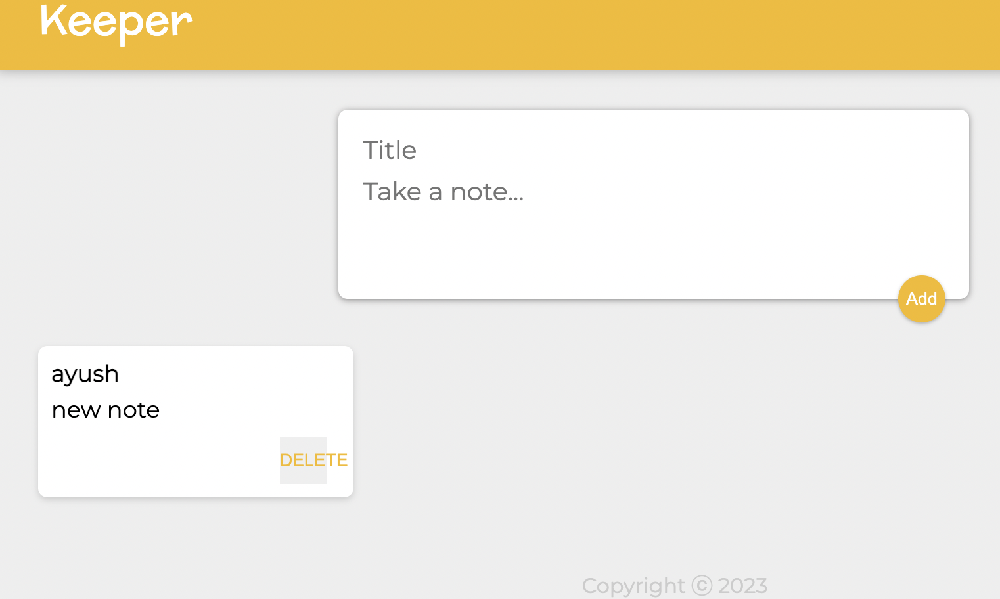
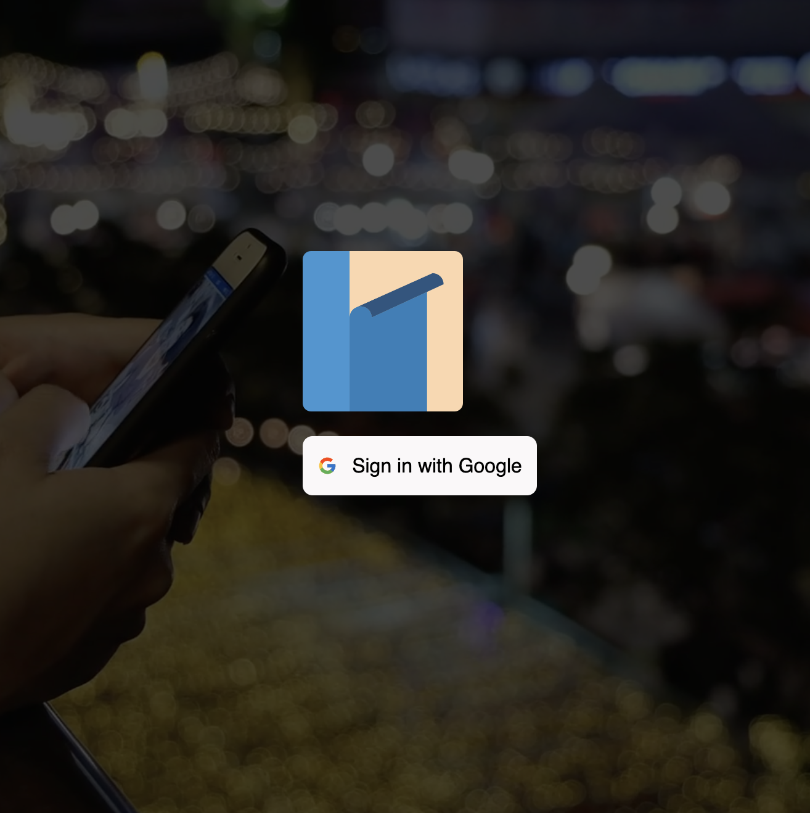
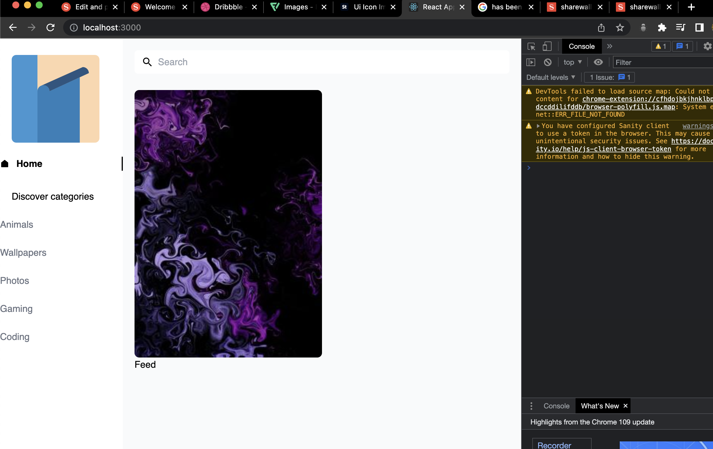
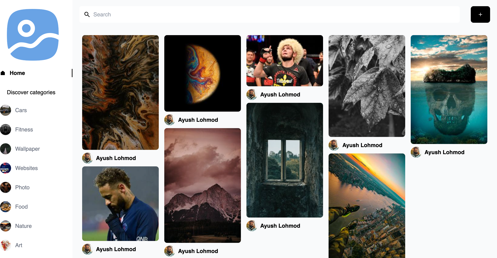

# 100 Days Of Code

## Log

### Day 000: October 24, 2022 (RestFul API)

**Today's Progress**:

Build Rest API 
ADD a postman to send post request it will send the data to Studio 3t(The mongoDB client

**Link to work:**

- <https://github.com/ayushlohmod/REST-API>

### Day 001: October 25, 2022 (Complete RestFull API)

**Today's Progress**:

today's task is to complete the restfull api
1. GET - Done
2. POST - Done
3. DELETE - Done
4. POST - Done
5. PATCH - Done


### Day 002: October 26, 2022 (Web Authentication)

**Today's Progress**:

Starting a web protection project
1. Learn how and why Web Protection
2. Setup The environment to start web Authentication project 

### Day 003: October 27, 2022 (Frontend of Web Authentication)

**Today's Progress**:

1. setup the initial project files
2. Design the frontend of the website using Bootstrap ejs css html

### Day 004: October 28, 2022 (Backend of Web Authentication)

**Today's Progress**:

1. design the backend so that website and coneect to server

### Day 005: October 29, 2022 (Database on Web Authentication)

**Today's Progress**:

1. implemented A database to a web authentication app
2. learned 3 level of sequrity

### Day 006: October 30, 2022 (Level 1 Security)

**Today's Progress**:

1. Applied Level 1 security - creating an account for a user (Email & Password) and store there data
2. implemented mongoDB for Users account

### Day 007: October 31, 2022 (level 2 Encription)

**Today's Progress**:

1. Applied a encription to website using mongoose pacage (dotenv)
2. it takes users password and encrypted using a encryption key and using a particular cipher method to a ciphertext which will make it hard for peoples to guess whats the password actually is
3. Also using git ignore hide the encrption key in .env file

**UPDATE-**
**Adding level 3 security (hashing)**:
 
1. Add hashing encryption to website because the cipher encreaption is weaker and hashing is much stronger
2. Use md5 package from ndm for hashing
 

**Link to work:**

- <https://github.com/ayushlohmod/WEB-Authentication>


### Day 008: November 01, 2022 (Ideas - Brainstorming)

So today i take a break and brainstroming what i can build and 


### Day 009: November 02, 2022 (level 4 Hashing & Salting)

**Today's Progress**:
1. using A new hashing method bcrypt for even more sequrity Bcrypt add a sault to hasing to make it more complex passwords to be creaked 

**UPDATE-**
**Adding level 5 security (cookies)**:
Added cookies so browsers can now store the information in form of cookies it prevent to login in again and again


### Day 010: November 03, 2022 (level 6 OAuth)

**Today's Progress**:
Added a Oauth method so user can now login with googel accounts no need to creat a new one
added a button for google signin

### Day 011: November 04, 2022 (React)

**Today's Progress**:
Start learning react 
learn some moduels


### Took a Little break 

### Day 012: November 07, 2022 (React)

**Today's Progress**:
Learning Jsx


### Day 013: November 12, 2022 (jsx)

**Today's Progress**:
Jsx inline

### Day 014: November 14, 2022 (Custom styling)

**Today's Progress**:
today i learn about react custom styling
created a program where it changes date colour based on time 

```javascript

import React from "react";
import ReactDOM from "react-dom";

const date = new Date();
const currenTime = date.getHours();

let greeting;
const CustomStyle = {
  clour: ""
};

if (currenTime < 12) {
  greeting = "Good Morning";
  CustomStyle.color = "red";
} else if (currenTime < 18) {
  greeting = "Good Afternoon";
  CustomStyle.color = "blue";
} else {
  greeting = "Good Night";
  CustomStyle.color = "green";
}

ReactDOM.render(
  <h1 className="heading" style={CustomStyle}>
    {greeting}
  </h1>,

  document.getElementById("root")
);
```

### Day 015: November 14, 2022 (Compentents)
**Today's Progress**:

More react compoent 
Also gonna start Machine learnign and AWS

### Day 016: November 15, 2022 (Note-Keeper app)

**Today's Progress**:
today i created a simple Note keeper app using react
its a clone like google notes


**Link to work:**

- <https://github.com/ayushlohmod/Note-Keeper>


### Day 017: November 15, 2022 (Note-Keeper app Update)

**Today's Progress**:
Add/rendered all the left out notes now the app can show all the notes on a screen
used array function to do the task

```javascript

import React from "react";
import Header from "./Header";
import Footer from "./Footer";
import Note from "./Note";
import notes from "../notes";

function App() {
  return (
    <div>
      <Header />
      {notes.map((noteItem) => (
        <Note
          key={noteItem.key}
          title={noteItem.title}
          content={noteItem.content}
        />
      ))}
      <Footer />
    </div>
  );
}

export default App;

```


### Day 018: November 29, 2022 (Tensorflow)

**Today's Progress**:
I started the FreeCodeCamps Mashine Learning Course not initialy the idea behind 100daysofcode but I need those information for some data science stuff programms I want to build :)


### Day 019: November 29, 2022 (React Form)
**Today's Progress**:
today i created a front page using react

```javascript
import React, {useState} from "react";

function App() {
  const [headingText, sumbittext] = useState("Hello");
  const [isMouseOver, setMouseOver] = useState(false);
function handelClicked(){
  sumbittext("Submitted");
}
function handelMouseOver(){
  setMouseOver(true);
}
function handelMouseOut(){
  setMouseOver(false);
}
  return (
    <div className="container">
      <h1>{headingText}</h1>
      <input type="text" placeholder="What's your name?" />
      <button style={{backgroundColor : isMouseOver ? "black" : "white"}} onClick ={handelClicked} 
      onMouseOver = {handelMouseOver}
      onMouseOut = {handelMouseOut}
      >Submit</button>
    </div>
  );
}
export default App;


```


### Day 020: january 6, 2023 (React)
**Today's Progress**:
addede delete functionalty to my react keeper app


**Today's Progress**:

I started the FreeCodeCamps Mashine Learning Course not initialy the idea behind 100daysofcode but I need those information for some data science stuff programms I want to build :)

**Link to work:**

- <https://github.com/ayushlohmod/machine-learning>


### Day 021: january 6, 2023 (Meren app)
**Today's Progress**:
today i did some digging and search for reasources/Materials i want to use in this project

### Day 022: january 18, 2023 (Meren app)
**Today's Progress**:
Applied the basic backend and frontend files

### Day 023: january 18, 2023 (Meren app)
**Today's Progress**:
Added a login page to my socail media app

### Day 024: january 18, 2023 (Meren app)
**Today's Progress**:
Created a front page og my app using talwin css
and added a google login 
```javascript
            <div className='shadow-2xl'>
              <GoogleLogin 
                clientId=''
                render={(renderProps)=>(
                  <button type='button' className='bg-mainColor flex justify-center items-center p-3 rounded-lg'
                  onClick={renderProps.onClick}
                  disabled = {renderProps.disabled}
                  >
                  <FcGoogle className='mr-3'/> Sign in with Google

                  </button>

                )}
                onSuccess={responseGoogle}
                onFailure={responseGoogle}
                cookiePolicy="singel_host_origin"
              />
```




### Day 025: january 18, 2023 (Meren app)
**Today's Progress**:
added a google auth to my app and connected to santiy

### Day 026: january 18, 2023 (Meren app)
**Today's Progress**:
today i try to solv a error with does't let me login using google Oauth

### Day 027: january 18, 2023 (Meren app)
**Today's Progress**:
Added a sidebar for my webapp and add some categories
optimise for desktop view

### Day 028: january 18, 2023 (Meren app)
**Today's Progress**:
added a search bar in my webapp
```javascript
const Navbar = ( {searchTerm, setSearchTerm, user}) => {
  const navigate = useNavigate();
  // if(!user) return null;
  return (
    <div className='flex gap-2 md:gap-5 w-full mt-5 pb-7'>
    <div className='flex justify-start items-center w-full px-2 rounded-md bg-white border-none outline-none focus-within:shadow-sm'>
      <IoMdSearch fontSize={21} className='ml-1' />
      <input 
        type='text'
        onChange={(e)=> setSearchTerm(e.target.value)}
        placeholder="Search"
        value={searchTerm}
        onFocus={() => navigate('/search')}
        className='p-2 w-full bg-white outline-none'
      />
    </div>
    </div>
  )
}
```
it start getting in shape

### Day 029: january 18, 2023 (Meren app)
**Today's Progress**:
today i created a loading component which shows loding icon when when loading feed

### Day 030: january 18, 2023 (Meren app)
**Today's Progress**:
TODAY I DO SOME DIGGING ON HOW TO ADD A PINS TO MY APPS FEED STILL WORKING ON IT BUT FOR SOMEREASON ITS NOT SHOWING PINS ON MY FEED I WILL TRY TO FIX IT

### Day 031: january 18, 2023 (Meren app)
**Today's Progress**:
My app feed not showing pins(content) its the 3rd day of found a way out and i am still stuglling
also Since GoogleOauth release new way to add google sign in but i have to re write some code to make it work

### Day 032: january 18, 2023 (Meren app)
**Today's Progress**:
Finally i make it work my feed bug take a look how its loking currently




### Day 033: january 18, 2023 (Meren app)
**Today's Progress**:
added some neccesasroy buttons 
- save button
- delete button
- download button

 also added more information to my feed post like
- user id 
- user website

There are still lots of bugs that needs to be solved but currently i am working to add all the components
first to the webapp then i will try to resolve all the issues and polish some works 
there are lots of things that not feels right or doest work at all i will solve all of this at end

### Day 034: january 18, 20
**Today's Progress**:
added a button which can access the creatPin component in that you can upload new images or photos 
thata can later added to main feed by using this now user can easily upload new images

note: this will sometime shows error i will try to fix it

**Link to work:**

- <https://github.com/ayushlohmod/shareWall>


### Day 035: january 18, 20
**Today's Progress**:

Fixed the Bug where image is not appearing in upload section 

also added moore colums to upload image and added a colum wher you can chose
the category of your upload

- Titile
- About
- destination

For some reason the image is unable to upload to sanity server showing some erroe
it is showing some undefined error i will solv it as soon as posible and
i will try to fix that tomorrow and upload the latest changes to the <https://github.com/ayushlohmod/shareWall> 
also 

### Day 036: january 18, 20
**Today's Progress**:

Fixed the Bug where image is unable to upload to sanity database

Added a new feature where you can see the details of the images by taping on 
it shows all the information about image and shows some crusiol information

All the latest chages are now avilable
these changes yet to merge on main project there are some work left to add as feature
as it done i am done with feature part then i will solve bugs and refine the code

**Link to work:**

- <https://github.com/ayushlohmod/shareWall>

### Day 037: january 18, 20
**Today's Progress**:
today added a comment section where you can comment down and post it 

BUG: for some reason the comment is not showing i will try to fix it tomorrow

Also added a similar post category where yoy can see similar post to your current category post

All the latest changed has been already pushed to sharewall repostry


### Day 038: january 18, 20
**Today's Progress**:
Today bit lazy made some changes to userprofile route fix the bug where not showing the 
loading icon 

### Day 039: january 18, 20
**Today's Progress**:
Today i try to create a profile page but since my Googlelogin isnot working properly it dint 
show me anything it suppose to show imgaes from the link and change everytime refrest it
but it didnt work 

Whell now there is another bug to solve for now i will leave it that i will try to 
do some other part and when its done i will try to reoslve it

### Day 040: january 18, 20
**Today's Progress**:
Today i added a search system now you can search the post by searching on navbar
also replace the categories to real ones and added category images for better understanding
For some reason Masonry layout is not working so the post size is not equal to one another
i will try to fix it tomorrow

The main content is now done except the user profile page so my next task is to solve the
Login page and make it work then i will finish the userProfile page

**Link to work:**

- <https://github.com/ayushlohmod/shareWall>

### Day 041: january 18, 20
**Today's Progress**:
Today i add a new fresh logo to my website removed the old temprarly one
this logo is more refined and looks good
also change the login file added a new Google oauth it now shows the
login button but still it shows some error of accessing it i will try to
figure out what it was 
Now i started to improved the website as soon as the login system work
i will make couple of changed hear and ther to make it complete


### Day 042: january 18, 20
**Today's Progress**:
Today i started learning about DevOps 
yamil

### Day 043: january 18, 20
**Today's Progress**:
Today i learned about shell scripting and wrote some basic script

### Day 044: january 18, 20
**Today's Progress**:
today i learned docker

### Day 045: january 18, 20
**Today's Progress**:

DevOps progress 

1. Networking - Done
2. Yaml - Done
3. ShellScripting - Done
4. Docker - Done - also build a nodejs app with docker
5.  Kubernetes - Done
6.  service mesh - Done
7.  Github CI CD - Done

**Link to work:**

- <https://github.com/ayushlohmod/devops>


For the past 2 months i am incontinence as i am sick slowely recovering 

Also did some much needed work on my Website Sharewall
! Fixed 

1. Login issue - Login issue is fixed now i can login with my Gmail
2. post unable to show profile pic is fixed
3. the comment section is now looking organised
4. Image cant upload is fixed 



the feature part is completed and the branch is merged all the code in merged to main branch 

**Link to work:**

- <https://github.com/ayushlohmod/shareWall>

### Day 046: january 18, 20
**Today's Progress**:
Today i worked on Sharewall fix some major bugs
fix the comments are not visible or not posting below images
Latest changes are merged to main branch
Also deployed the app on netlify but i have a domain name so it redirects 

**Deployed App:**

- <https://ayushlohmod.live>

**Link to work:**

- <https://github.com/ayushlohmod/shareWall>

### Day 047: january 18, 20
**Today's Progress**:
So i am decided to build my portfolio website
Starting from today
today i little bit brainstrom to see how and what i can build got some ideas 

### Day 048: january 18, 20
**Today's Progress**:
Started Devops projects try to complete it without delay

### Day 049: january 18, 20
**Today's Progress**:
Completed jenkins
Completed Promethus
Completed New relic

### Day 050: july 1, 2023
**Today's Progress**:
Took a break but from now onwards i will continue 
So today i try to build a devOps project 
i will update it as i finished also the work is in the DevOps Repo

### Day 050: july 1, 2023
**Today's Progress**:
Created a python File to do some function 

### Day 050: july 1, 2023
**Today's Progress**:
Started to build a portfolio

### Day 050: july 1, 2023
**Today's Progress**:
Today did some work on my protfolio website have some initial ideas i will
try to implement in comming days and see how it will looks

**Link to work:**

- <https://github.com/ayushlohmod/Portfolio>

