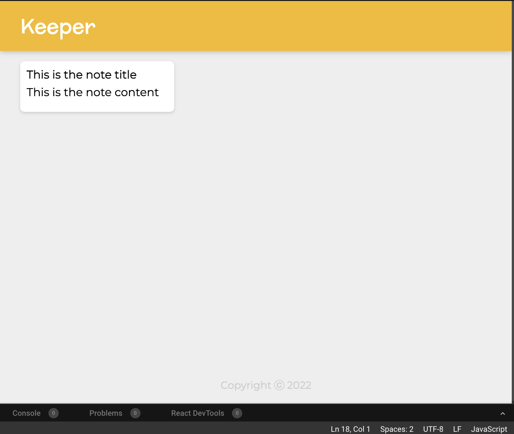

# 100 Days Of Code

## Log

### Day 000: October 24, 2022 (RestFul API)

**Today's Progress**:

Build Rest API 
ADD a postman to send post request it will send the data to Studio 3t(The mongoDB client

**Link to work:**

- <https://github.com/ayushlohmod/REST-API>

### Day 001: October 25, 2022 (Complete RestFull API)

**Today's Progress**:

today's task is to complete the restfull api
1. GET - Done
2. POST - Done
3. DELETE - Done
4. POST - Done
5. PATCH - Done


### Day 002: October 26, 2022 (Web Authentication)

**Today's Progress**:

Starting a web protection project
1. Learn how and why Web Protection
2. Setup The environment to start web Authentication project 

### Day 003: October 27, 2022 (Frontend of Web Authentication)

**Today's Progress**:

1. setup the initial project files
2. Design the frontend of the website using Bootstrap ejs css html

### Day 004: October 28, 2022 (Backend of Web Authentication)

**Today's Progress**:

1. design the backend so that website and coneect to server

### Day 005: October 29, 2022 (Database on Web Authentication)

**Today's Progress**:

1. implemented A database to a web authentication app
2. learned 3 level of sequrity

### Day 006: October 30, 2022 (Level 1 Security)

**Today's Progress**:

1. Applied Level 1 security - creating an account for a user (Email & Password) and store there data
2. implemented mongoDB for Users account

### Day 007: October 31, 2022 (level 2 Encription)

**Today's Progress**:

1. Applied a encription to website using mongoose pacage (dotenv)
2. it takes users password and encrypted using a encryption key and using a particular cipher method to a ciphertext which will make it hard for peoples to guess whats the password actually is
3. Also using git ignore hide the encrption key in .env file

**UPDATE-**
**Adding level 3 security (hashing)**:
 
1. Add hashing encryption to website because the cipher encreaption is weaker and hashing is much stronger
2. Use md5 package from ndm for hashing
 

**Link to work:**

- <https://github.com/ayushlohmod/WEB-Authentication>


### Day 008: November 01, 2022 (Ideas - Brainstorming)

So today i take a break and brainstroming what i can build and 


### Day 009: November 02, 2022 (level 4 Hashing & Salting)

**Today's Progress**:
1. using A new hashing method bcrypt for even more sequrity Bcrypt add a sault to hasing to make it more complex passwords to be creaked 

**UPDATE-**
**Adding level 5 security (cookies)**:
Added cookies so browsers can now store the information in form of cookies it prevent to login in again and again


### Day 010: November 03, 2022 (level 6 OAuth)

**Today's Progress**:
Added a Oauth method so user can now login with googel accounts no need to creat a new one
added a button for google signin

### Day 011: November 04, 2022 (React)

**Today's Progress**:
Start learning react 
learn some moduels


### Took a Little break 

### Day 012: November 07, 2022 (React)
Learning Jsx


### Day 013: November 12, 2022 (jsx)
Jsx inline

### Day 014: November 14, 2022 (Custom styling)
today i learn about react custom styling
created a program where it changes date colour based on time 

```javascript

import React from "react";
import ReactDOM from "react-dom";

const date = new Date();
const currenTime = date.getHours();

let greeting;
const CustomStyle = {
  clour: ""
};

if (currenTime < 12) {
  greeting = "Good Morning";
  CustomStyle.color = "red";
} else if (currenTime < 18) {
  greeting = "Good Afternoon";
  CustomStyle.color = "blue";
} else {
  greeting = "Good Night";
  CustomStyle.color = "green";
}

ReactDOM.render(
  <h1 className="heading" style={CustomStyle}>
    {greeting}
  </h1>,

  document.getElementById("root")
);
```

### Day 015: November 14, 2022 (Compentents)
More react compoent 
Also gonna start Machine learnign and AWS

### Day 016: November 15, 2022 (Note-Keeper app)
today i created a simple Note keeper app using react
its a clone like google notes



**Link to work:**

- <https://github.com/ayushlohmod/Note-Keeper>


### Day 016: November 15, 2022 (Note-Keeper app Update)
